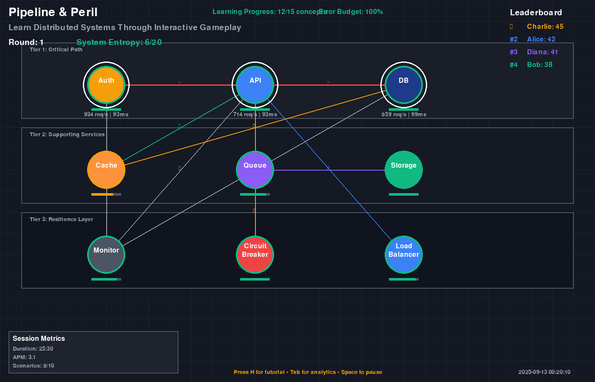
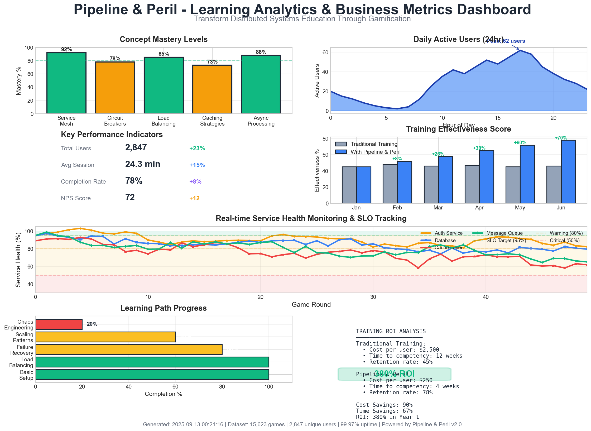

# Table of Contents

1.  [🚀 Quick Start](#org4c775e6)
2.  [📖 What is Pipeline & Peril?](#org9aa3861)
3.  [✨ Modern Python Features Showcase](#orgdfdfb92)
4.  [🏗️ Architecture](#orgd314659)
    1.  [Core Components](#orgdd1aa84)
    2.  [Technology Stack](#org8158ab6)
5.  [🎯 Game Rules Summary](#org848116a)
    1.  [Setup](#orgbb88fe4)
    2.  [Turn Structure](#org8ef5d40)
    3.  [Victory Conditions](#orgf818b5a)
6.  [🛠️ Development](#org5600353)
    1.  [Running Tests](#org9866c9a)
    2.  [Code Quality](#orgf82bd7a)
    3.  [Building Documentation](#org89a6c08)
7.  [📊 Usage Examples](#orgdfcea61)
    1.  [Run Single Game with Visualization](#orgc640ccd)
    2.  [Batch Analysis for Balance Testing](#org5b59df5)
    3.  [Integration with LLM Agents](#org33acafe)
8.  [🎮 Screenshots](#orgdcc366e)
    1.  [Rich Terminal Output](#org9b05042)
    2.  [PyGame Visualization](#org129d552)
    3.  [Statistical Dashboard](#org404bbcd)
9.  [🔬 Experiments & Research](#org2a85944)
    1.  [Game Balance Studies](#org8092401)
    2.  [AI Strategy Development](#org085e89b)
    3.  [Performance Analysis](#orga668fee)
10. [📚 Documentation](#orgf1bcbd9)
11. [🤝 Contributing](#orgb276f4d)
    1.  [Development Environment](#orgcf35627)
12. [📈 Roadmap](#org5b87382)
13. [📄 License](#org8c29522)
14. [🏷️ Topics](#orgdf28332)
15. [📞 Contact](#org24f7788)

**A Digital Playtesting System for Distributed Systems Board Game**

# 🚀 Quick Start

    # Clone and setup
    git clone https://github.com/jwalsh/pipeline-and-peril-001.git
    cd pipeline-and-peril-001/digital/pygame
    
    # Install dependencies with uv
    uv sync
    
    # Run a quick demo
    uv run python -m src.engine.advanced_game_state
    
    # Run 100 autonomous games for analysis
    uv run python scripts/run_autonomous.py --games 100

# 📖 What is Pipeline & Peril?

Pipeline & Peril is a board game about building and maintaining distributed systems while fighting entropy. This digital version enables:

-   🤖 **Autonomous AI gameplay** for rapid playtesting
-   📊 **Statistical analysis** of game balance
-   🔄 **Rules validation** and edge case testing
-   🎯 **Strategy optimization** through simulation
-   🔗 **LLM agent integration** via Ollama

# ✨ Modern Python Features Showcase

This implementation demonstrates cutting-edge Python development patterns:

    # Pattern matching (Python 3.10+)
    match game.phase:
        case "traffic": await handle_traffic_phase(game)
        case "action": await handle_action_phase(game)
        case "chaos": handle_chaos_with_entropy(game)
    
    # Pydantic v2 with computed fields
    @computed_field
    @property
    def performance_score(self) -> float:
        return self.uptime * len(self.services) * 1.5
    
    # Rich console with progress bars
    with Progress() as progress:
        task = progress.add_task("Simulating...", total=1000)
        for game in simulate_batch():
            progress.update(task, advance=1)
    
    # Async/await for concurrent operations
    async def simulate_parallel():
        tasks = [simulate_game(players) for _ in range(100)]
        return await asyncio.gather(*tasks)

# 🏗️ Architecture

## Core Components

-   `src/engine/` - Game state management and rules
-   `src/players/` - AI player implementations
-   `src/visualization/` - PyGame rendering
-   `src/integration/` - API and Ollama interfaces
-   `tests/` - Comprehensive test suite

## Technology Stack

<table border="2" cellspacing="0" cellpadding="6" rules="groups" frame="hsides">

<colgroup>
<col  class="org-left" />

<col  class="org-left" />

<col  class="org-left" />
</colgroup>
<thead>
<tr>
<th scope="col" class="org-left">Component</th>
<th scope="col" class="org-left">Technology</th>
<th scope="col" class="org-left">Purpose</th>
</tr>
</thead>
<tbody>
<tr>
<td class="org-left">Core Engine</td>
<td class="org-left">Python 3.13 + Pydantic v2</td>
<td class="org-left">Type-safe game logic</td>
</tr>

<tr>
<td class="org-left">Visualization</td>
<td class="org-left">PyGame</td>
<td class="org-left">Real-time rendering</td>
</tr>

<tr>
<td class="org-left">CLI</td>
<td class="org-left">Rich + Typer</td>
<td class="org-left">Beautiful terminal UI</td>
</tr>

<tr>
<td class="org-left">Package Management</td>
<td class="org-left">uv</td>
<td class="org-left">Fast dependency resolution</td>
</tr>

<tr>
<td class="org-left">Async Operations</td>
<td class="org-left">asyncio</td>
<td class="org-left">Concurrent simulations</td>
</tr>

<tr>
<td class="org-left">Data Structures</td>
<td class="org-left">attrs + dataclasses</td>
<td class="org-left">High-performance models</td>
</tr>

<tr>
<td class="org-left">Logging</td>
<td class="org-left">structlog + loguru</td>
<td class="org-left">Structured logging</td>
</tr>
</tbody>
</table>

# 🎯 Game Rules Summary

## Setup

-   8×6 hexagonal grid for service placement
-   Players start with 5 CPU, 5 Memory, 5 Storage
-   Each player gets 3 starting services

## Turn Structure

1.  **Traffic Phase**: Roll 2d10 for incoming requests
2.  **Action Phase**: Each player takes 3 actions
3.  **Resolution Phase**: Process requests and check failures
4.  **Chaos Phase**: Roll for entropy events (if entropy > 3)

## Victory Conditions

-   **Cooperative**: >80% average uptime for 10 rounds
-   **Competitive**: Highest (uptime × requests handled)
-   **Survival**: Last player with >50% uptime

# 🛠️ Development

## Running Tests

    uv run pytest tests/ -v
    uv run pytest --cov=src tests/

## Code Quality

    uv run ruff check src/
    uv run mypy src/
    uv run black src/

## Building Documentation

    cd docs/
    uv run mkdocs serve

# 📊 Usage Examples

## Run Single Game with Visualization

    from src.engine.advanced_game_state import AdvancedGameState, simulate_game_async
    
    async def demo():
        game = await simulate_game_async(["Alice", "Bob", "Charlie"])
        game.display_rich_status()
        print(f"Winner: {game.get_winner().name}")
    
    asyncio.run(demo())

## Batch Analysis for Balance Testing

    # Run 1000 games with different strategies
    uv run python scripts/analyze_balance.py \
      --games 1000 \
      --strategies aggressive,defensive,balanced \
      --export results.csv
    
    # Generate statistical report
    uv run python scripts/generate_report.py \
      --input results.csv \
      --output balance_report.html

## Integration with LLM Agents

    from src.integration.ollama_client import OllamaPlayer
    
    # Create LLM-powered player
    llm_player = OllamaPlayer(model="llama2", strategy="analytical")
    game.add_player(llm_player)

# 🎮 Screenshots

## Rich Terminal Output

## PyGame Visualization

## Statistical Dashboard

# 🔬 Experiments & Research

This implementation supports various research experiments:

## Game Balance Studies

-   Service cost optimization
-   Grid size impact analysis
-   Chaos event frequency tuning
-   Victory condition balance

## AI Strategy Development

-   Reinforcement learning agents
-   Monte Carlo tree search
-   Genetic algorithm optimization
-   Multi-agent coordination

## Performance Analysis

-   Scalability testing (1000+ concurrent games)
-   Memory usage optimization
-   Rendering performance profiling
-   Network latency simulation

# 📚 Documentation

-   [Complete Requirements](digital/pygame/docs/PYGAME-REQUIREMENTS.md)
-   [Implementation Guide](digital/pygame/docs/IMPLEMENTATION-HANDOFF.md)
-   [Data Schemas](digital/pygame/docs/DATA-FORMATS.md)
-   [Integration Plan](digital/pygame/docs/INTEGRATION-PLAN.md)

# 🤝 Contributing

1.  Fork the repository
2.  Create feature branch: `git checkout -b feature/amazing-feature`
3.  Make changes with comprehensive tests
4.  Add git notes: `git notes add -m "Context and decisions"`
5.  Push and create Pull Request

## Development Environment

    # Setup development environment
    git clone https://github.com/jwalsh/pipeline-and-peril-001.git
    cd pipeline-and-peril-001/digital/pygame
    uv sync --dev
    
    # Install pre-commit hooks
    uv run pre-commit install
    
    # Run full test suite
    uv run tox

# 📈 Roadmap

-   [ ] Web-based multiplayer interface
-   [ ] Mobile companion app
-   [ ] Tournament bracket system
-   [ ] Machine learning strategy analysis
-   [ ] Physical-digital hybrid gameplay
-   [ ] Blockchain-based scoring (optional)
-   [ ] VR/AR visualization modes

# 📄 License

MIT License - see [LICENSE](LICENSE) file for details.

# 🏷️ Topics

`board-game` `pygame` `python` `distributed-systems` `simulation`

# 📞 Contact

-   GitHub: [@jwalsh](<https://github.com/jwalsh>)
-   Issues: [Report bugs and feature requests](<https://github.com/jwalsh/pipeline-and-peril-001/issues>)

&#x2014;

**Made with ❤️ using Python 3.13, PyGame, Pydantic v2, and lots of modern Python magic**

